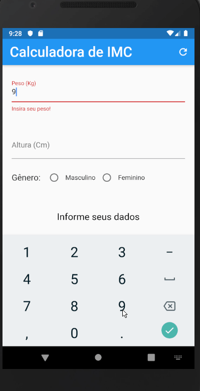

<h1> Project - Calculator IMC </h1>

Aplicativo de uma calculadora de IMC criado para disciplina de Programação Mobile com Flutter.

    

## Desafios resolvidos do projeto:

:heavy_check_mark:   Adicionar botões (Toggle ou Radio button) para escolha de gênero ([masculino](https://indicedemassacorporal.com/movel/calculo-imc-masculino.html) / [feminino](https://indicedemassacorporal.com/movel/calculo-imc-feminino.html));

:heavy_check_mark:   Corrigir o calculo de acordo com o gênero (masculino e feminino);

:heavy_check_mark:   Criar um classe Pessoa com os atributos (peso, altura e gênero), criar métodos para calcular IMC e classificar;

:heavy_check_mark:   Refatorar o código do aplicativo para utilizar a classe Pessoa;

:heavy_check_mark:   Aplicar uma escala de cores para o resultado da classificação do IMC;

:heavy_check_mark:   Aumentar o texto do resultado do IMC (número) e também colocar em negrito.
