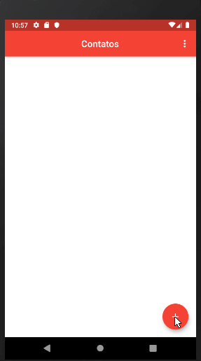

<h1> Project - Contact Book </h1>
  
Agenda de contatos um app desenvolvido como um propósito educacional, como um projeto de conclusão para disciplina da faculdade de programação de dispositivos móveis.  

Para esse projeto foi utilizado os seguintes plugins e suas versões:  
```
sqflite: ^1.1.5
url_launcher: ^5.0.2
image_picker: ^0.6.0+3
```  

Funcionalidades do App:  
__Adicionar um novo contato :__ incluir um novo contato à base de dados da agenda.    
__Editar :__ Consegue editar um contato existente.  
__Excluir :__ Deleta um contatos existente na base de dados.  
__Tirar Foto :__ Para adicionar uma foto no contato.  
__Ligar :__ Função para ligar para o contato.  

Demonstração do App:  
<p align="center">
    
</p>


