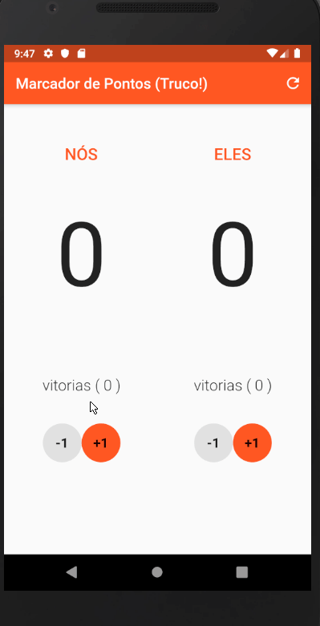

<h1> Project - Truco Maker </h1>

Aplicativo para marcar os pontos no jogo de truco criado para disciplina de Programação Mobile com Flutter.

<p align="center">
    


</p>

## Desafios resolvidos do projeto:

:heavy_check_mark: Não deixar que seja possível ficar com pontos negativos ao clicar em (-1) e também não poderá ultrapassar 12 pontos;

:heavy_check_mark: Permitir de alguma forma que a partida seja reiniciada, sem zerar o número de vitórias;

:heavy_check_mark: Transformar o AlertDialog em modal para que somente desapareça da tela ao clicar em CANCEL ou OK. Utilizando                              o atributo barrierDismissible;

:heavy_check_mark: Habilitar a Troca de nomes dos usuários ao clicar em cima do nome (Text). Utilizando um GestureDetector e exibindo um AlertDialog com um TextField;

:heavy_check_mark: Exibir uma notificação da mão de ferro: é a Mão de Onze especial, quando as duas duplas conseguem chegar a 11 pontos na                    partida. Todos os jogadores recebem as cartas “cobertas”, isto é, viradas para baixo, e deverão jogar assim. Quem                          vencer a mão, vence a partida;

:heavy_check_mark: Instalar o plugin Screen e adicionar um código para deixar a tela sempre ativa enquanto joga.

## Plugins

Plugins utilizados neste repositório.

| Plugin   | Pub                                                                                            |
| -------- | ---------------------------------------------------------------------------------------------- |
| Wakelock | [](https://pub.dev/packages/wakelock) |

## Uso

### Wakelock

```dart
import 'package:wakelock/wakelock.dart';

void main() => runApp(MyApp());
// ...

Wakelock.enable();

// ....
```

Você também precisa definir suas permissões no ```AndroidManifest.xml```

```dart


<uses-permission android:name="android.permission.WAKE_LOCK" />
```
