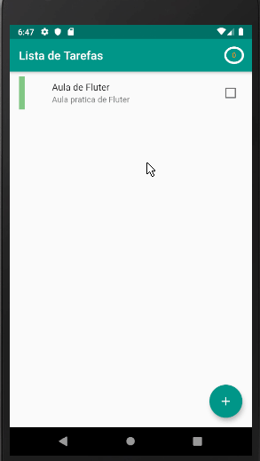

<h1> Project - Todo-List </h1>

Aplicativo para gerenciar as tarefas do dia-a-dia criado para disciplina de Programação Mobile.

    

## O que foi utilizado neste projeto?

**Bloc Patter** com  injeção de dependência

**Repository e DAO Pattern**

**SqlLite** - Banco de dados interno

**Bloc** - separação da regra de negocio da view

**Path_Provider** é uma extensão que ajuda a facilitar o caminho comum de armazenamento do dispositivo. Neste projeto será usado em conjunto com o Sqlite para armazenar o banco de dados no dispositivo

**Slidable** - lista deslizável com ações direcionais de slide

## Desafios

:heavy_check_mark: Na lista de tarefas, adicionar divisões entre as linhas

:heavy_check_mark: Adicionar validações no cadastro de uma atividade

:heavy_check_mark: Campo descrição precisar aceitar múltiplas linhas

:heavy_check_mark: Criar um campo para nível de prioridades que aceita valores entre 1 (baixa prioridade) e 5 (alta prioridade). Representar isso no card da forma como achar mais interessante.

:heavy_check_mark: Adicionar um [PercentIndicator] circular na barra de navegação para indicar a porcentagem de tarefas concluídas

